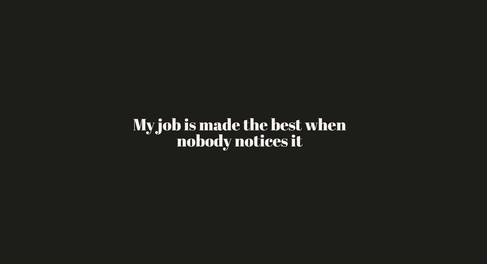

# Portfolio



My portfolio site — a single scroll-driven page walking through projects
(Hyperloop Control Station, Swiss Kyle, Lode), each broken down by UI/UX,
performance, and OS compatibility.

Built with Next.js (App Router), React, and Tailwind CSS. Screen-to-screen
navigation is driven by `app/lib/screenDefs.tsx`, animated with GSAP and Lenis.

## Getting started

```bash
npm install
npm run dev
```

Open [http://localhost:3000](http://localhost:3000).

## Scripts

- `npm run dev` — start the dev server
- `npm run build` — production build
- `npm run start` — run the production build
- `npm run lint` — lint the codebase

## Structure

- `app/page.tsx` — top-level scroll/screen controller
- `app/lib/screenDefs.tsx` — ordered list of screens and their content
- `app/components/pages/` — per-project, per-topic page content
- `app/components/ui/` — shared building blocks (`AnnotatedBlock`, `ImageBlock`, `VideoBlock`, etc.)
- `public/media/` — project screenshots, videos, and photos
